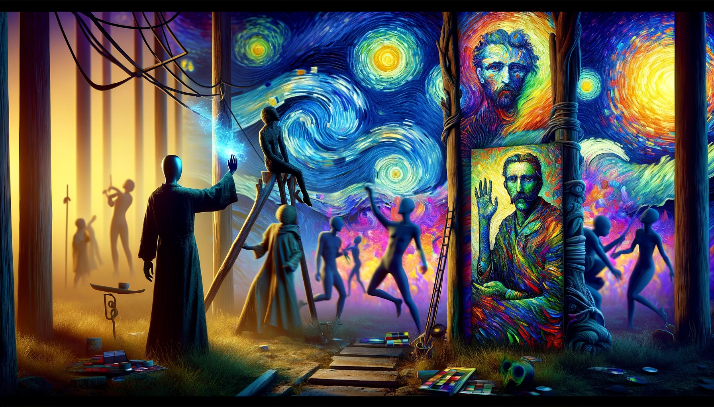

# Totem platform



## Overview

The totem platform currently has 2 apps: **RealTime Deep Fake**, **sdxl art**.

https://youtu.be/sSzMhEjYnTs

### RealTime Deep Fake

This app is a real time deep fake app. It uses a pre-trained model, called first-order motion, to detect faces and control them with a the camera.
It uses the gosai app "totem_app" and teh script "app.py" to run. The script requires different dependencies then GOSAI, so it is run as a sepearte script not a part of the GOSAI.

### SDXL Art

This app uses sdxl turbo by stability.ai to generate art. It uses the gosai app "totem_app" and the script "sdxl_api". The sdxl turbo model requires 9 GB of Vram and thus runs on the dgx. The sdxl endpoint can be found [here](https://github.com/COLVERTYETY/sdxlTurboEndpoint).

## installation

Please refer to the [GOSAI](https://github.com/GOSAI-DVIC/gosai) tutorial for installation.

**! Note ! :** This platform has specific drivers that are only available on the branch ```Nstas/totem-dev```. Can be found [here](https://github.com/GOSAI-DVIC/gosai/tree/Nstas/totem-dev).

### from scratch

1. clone the repo at the totem branch 

        git clone -b Nstas/totem-dev https://github.com/GOSAI-DVIC/gosai.git

2. clone the platform repo and rename it to home

        cd gosai
        git clone https://github.com/GOSAI-DVIC/totem.git home

3. install the dependencies
    
        make install
    
4. run the demo

        make stop && make boot

## Launch

If you are startign the app on the totem platform:
1. ```ctr+alt+T```: to open teh terminal 
2. ```./start_totem_demo.sh```: to start the demo !!

If you are starting the app on your own machine:

1. ```ctr+alt+T```: to open a terminal
2. ```cd /path/to/gosai```: to go to the gosai root directory
3. ```make stop && make boot```: to launch the gosai demo